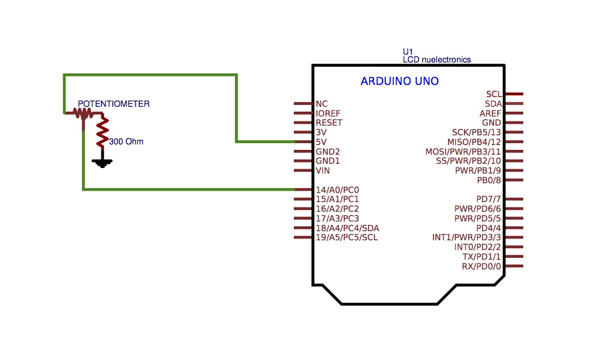
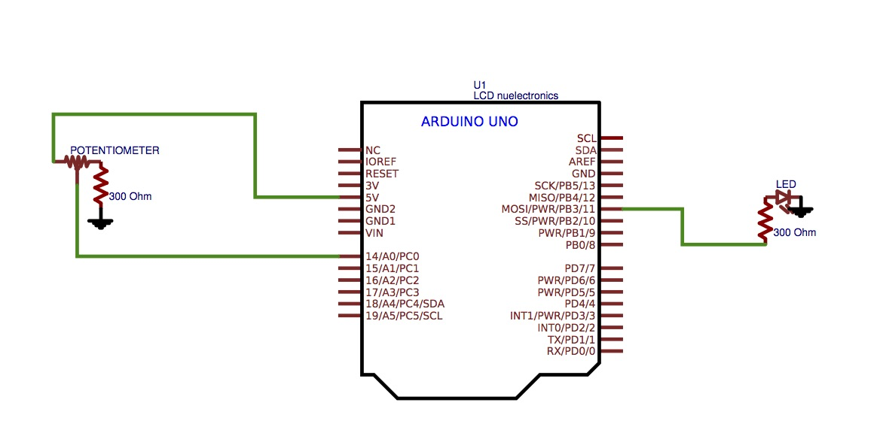
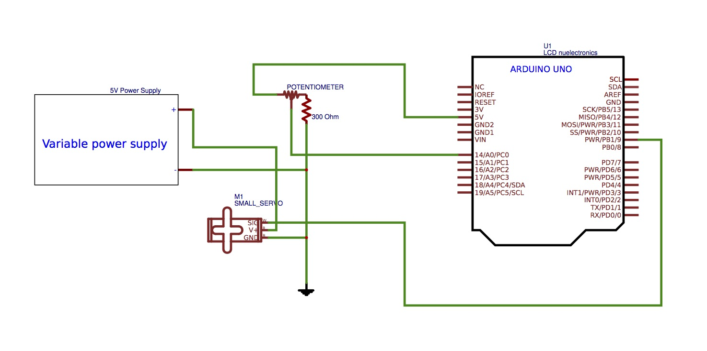

# Lab 1: Microcontrollers
Team 1: Amanda Trang, Emmett Milliken

Team 2: David Kim, Dylan Machado, Sofya Calvin

## Objective 
The goal of this lab was to introduce the concepts of the Arduino IDE as well as the Arduino Uno microcontroller itself. Additionally, we formed a basic structure for the robot and added a simple autonomous function.

## Procedure
We used the Arduino IDE to program write and upload our code to the Uno. To install the Arduino IDE, go to https://www.arduino.cc/en/Main/Software.

### Blinking an internal LED
To make the internal LED on the Arduino blink, we first set up the hardware as is outlined in the schematic below. It is important to have the 300 Ohm resistor in series with the potentiometer this will prevent too much current from being sourced to the pins.



In order to test whether or not our connection with the board was working, we used the example sketch, Blink (File>Examples>01.Basics>Blink). After uploading the sketch to the board, the on-board LED toggled on and off once per second, verifying that our connection and board were working. 

```
void setup() {
  // initialize digital pin 13 as an output.
  pinMode(13, OUTPUT);
}

void loop() {
  digitalWrite(13, HIGH);   // turn the LED on (HIGH is the voltage level)
  delay(1000);              // wait for a second
  digitalWrite(13, LOW);    // turn the LED off by making the voltage LOW
  delay(1000);              // wait for a second
}
```

### Blinking an external LED
To make an external LED blink (as opposed to the one built into the Arduino), we had to modify the schematic to add in the external LED as shown below:



We then modified the Blink sketch to blink an external LED through a digital output pin. Since digital output pins on the Uno will stop working if they are used to source too much current, we added a 330 ohm resistor in series with an LED. 

```
void setup() {
  // initialize digital pin 12 as an output.
  pinMode(12, OUTPUT);
}

// the loop function runs over and over again forever
void loop() {
  digitalWrite(12, HIGH);   // turn the LED on (HIGH is the voltage level)
  delay(1000);              // wait for a second
  digitalWrite(12, LOW);    // turn the LED off by making the voltage LOW
  delay(1000);              // wait for a second
}
```

### Reading the value of a potentiometer via the serial port
The next step was to test out using analog inputs. We used a potentiometer and a resistor to make a variable voltage input to the analog A0 pin on the board. To see the value of the input in real time we used the serial monitor, which allows us to print a value from the board to the screen. To do this we added this to the code:

```
Serial.println(voltage);
```

When we varied the position of the potentiometer, we were able to vary the output value printed to the serial monitor.

```
// Base code from https://www.arduino.cc/en/Tutorial/ReadAnalogVoltage
void setup() {
  // initialize serial communication at 9600 bits per second:
  Serial.begin(9600);
}

void loop() {
  int sensorValue = analogRead(A0);
  float voltage = sensorValue * (5.0 / 1023.0);
  Serial.println(voltage);
```

### Map the value of the potentiometer to the LED
The Arduino Uno does not have any analog output pins, but the digital output pins that can do pulse width modulation (PWM) are able to approximate the effect of an analog output. This is done using a digital signal with varying duty cycle (the percentage of a cycle for which the output of a signal is high, and if this happens fast enough, it acts as though the voltage is the time average value of the signal. So the high voltage multiplied by the duty cycle is the effective output voltage.
 
We then used this analog output to power an LED so that we could see the effect. Because the analog input values range from 0 to 1023, and the analog output values range from 0 to 255, we multiplied the value read from the input by 255/1023 when feeding that value to the analog output function. Here is our code:
 
```
void setup() {
  // initialize serial communication at 9600 bits per second:
  Serial.begin(9600);
  pinMode(3,OUTPUT);
}

void loop() {
  // read the input on analog pin 0:
  int sensorValue = analogRead(A0);
  // Convert the analog reading (which goes from 0 - 1023) to a voltage (0 - 5V):
  float voltage = sensorValue * (5.0 / 1023.0);
  analogWrite(3,sensorValue/4);
  // print out the value you read:
  Serial.println(voltage);
}
```

Using an oscilloscope, we checked the frequency of the signal and how it is affected by the potentiometer. This can be viewed in the following video:

[](https://www.youtube.com/watch?v=wA2syqGHpBw)

### Map the value of the potentiometer to the servo
To setup the servo, we again modified the LED setup, this time removing the LED component all together and replacing it with a servo motor and variable power supply which we held at 5V. The schematic is shown below:



We followed a method similar to mapping the potentiometer to the LED. Building off the code from the setup of the servos, we read the value of A0--our potentiometer value--and converted it to a value on a scale from 0-180, which we knew to be the range of the servos (from full reverse to full forward). We also printed the value to the Serial Monitor, just to ensure we were getting the correct values.

```
#include <Servo.h>
Servo pin;

void setup() {
  // initialize serial communication at 9600 bits per second:
  Serial.begin(9600);
  //pinMode(3,OUTPUT);
  pin.attach(9);
}

void loop() {
  // read the input on analog pin 0:
  int sensorValue = analogRead(A0);
 pin.write(sensorValue/5.68);
  // print out the value you read:
  Serial.println(sensorValue*180.0/1023.0);
}
```

This code was a success, allowing us to set the servo's speed and direction based on the potentiometer reading.

### Assemble your robot
The assembly portion of the robot was made difficult due to the range of components available. Many screws would not fit through the chassis, or would interfere with the servo due to length. After a series of guessing-and-checking different parts, we mounted two servos, two wheels, a ball caster, and the Arduino onto a chassis. We wired the servos similarly to the previous portion of the lab. 

This was more time-consuming than difficult, especially with a limited amount of Allen wrenches and only a certain amount of tasks that could be done at one time.

### Driving your robot autonomously
After assembling our simple robot, we wrote a simple program to attempt to run the robot in a square formation. We had to manually recalibrate the servos, as writing the value 90 to either one did not result in it stopping. We initialized both servos (named servoL and servoR for left and right, respectively):

```
#include <Servo.h>
Servo servoL;
Servo servoR;

void setup() {
  Serial.begin(9600);
  servoL.attach(9);
  servoR.attach(10);
  //pinMode(11, OUTPUT);
  //pinMode(12, OUTPUT);
}
```

and wrote a forward() function as well as a right() function. Knowing that 0 would be "full reverse" and 180 was "full forward," we initially set each servo to 180 for forward(). After attempting to run the program, we realized one of the servos was mounted backwards, with respect to the other, and then modified our code to write 0 to servoR.

```
void forward(int msec) {
  servoL.write(180);
  servoR.write(0);
  //digitalWrite(11, HIGH);
  //digitalWrite(12, HIGH);
  delay(msec);
}

void right(int msec) {
  servoL.write(180);
  servoR.write(90);
  //digitalWrite(11, HIGH);
  //digitalWrite(12, LOW);
  delay(msec);
}
```

We also added in two LEDs that flashed their respective colors to visually see whether the code was running "forward" or "right."  In reality, the robot went in a very questionable quadrilateral-like shape, as we did not have enough time to fine-tune the time values. Any code relating to the LEDs has been commented out due to an issue causing the servos to run incorrectly. If the LEDs are implemented in the future, we will debug this code.

```
void loop() {
  forward(5000);
  right(2000);
  forward(5000);
  right(2000);
  forward(5000);
  right(2000);
  forward(5000);
}
```


[Return to home](https://sofyacalvin.github.io/ece3400-group3/)
