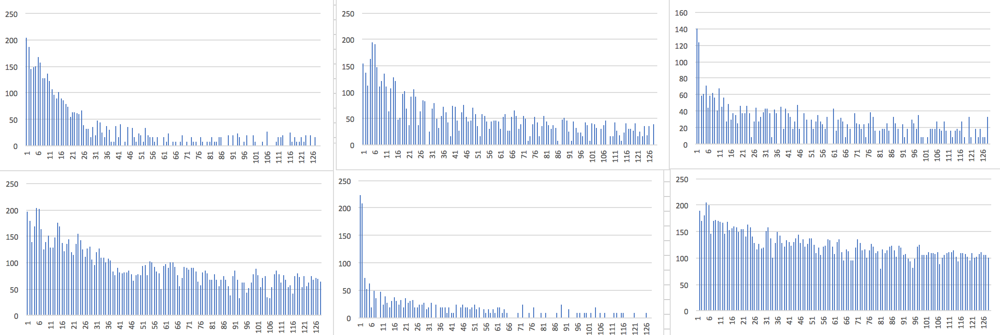
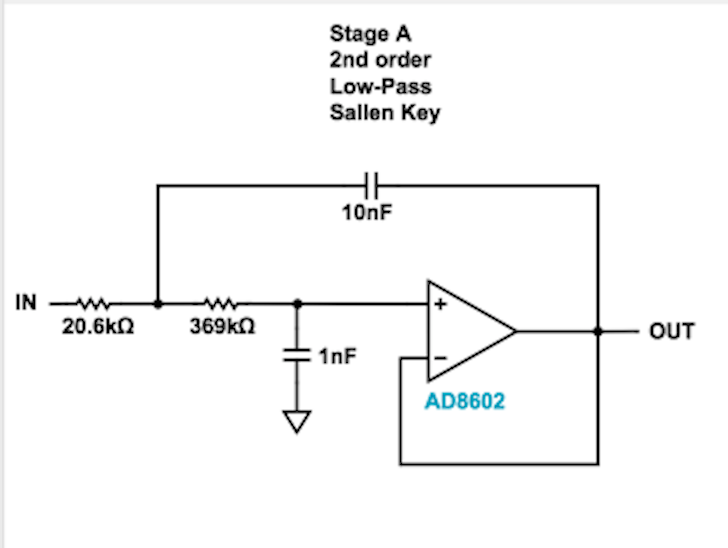
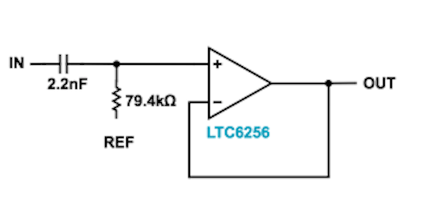
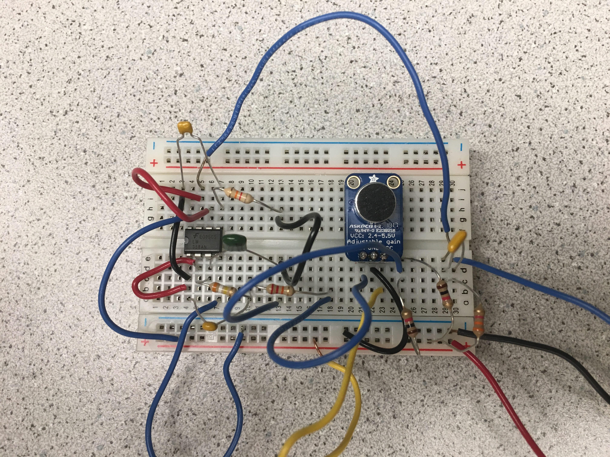
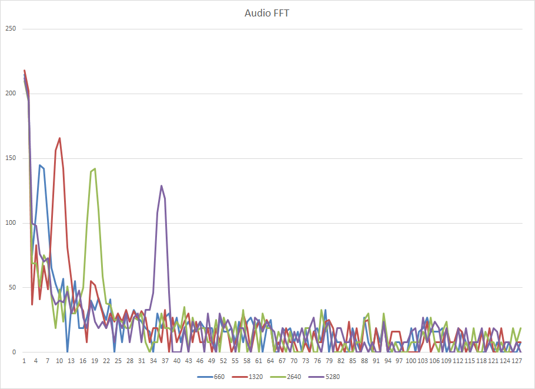
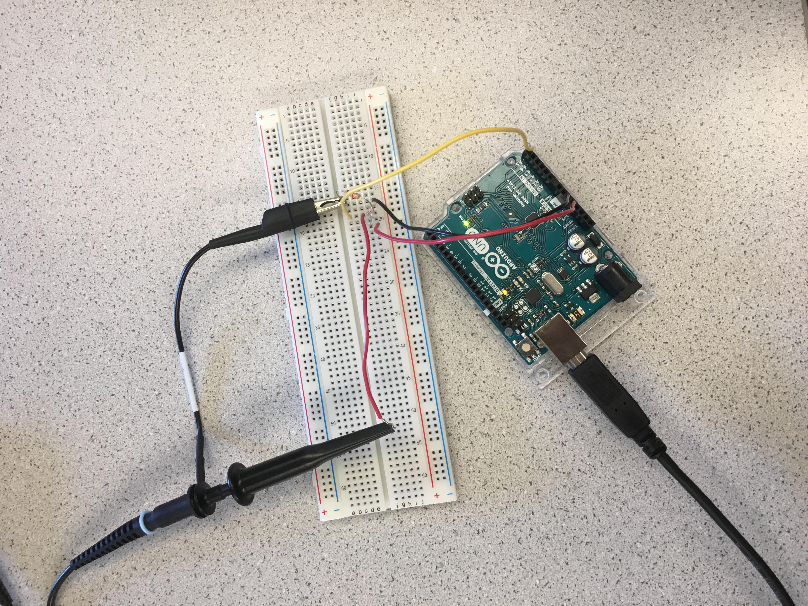
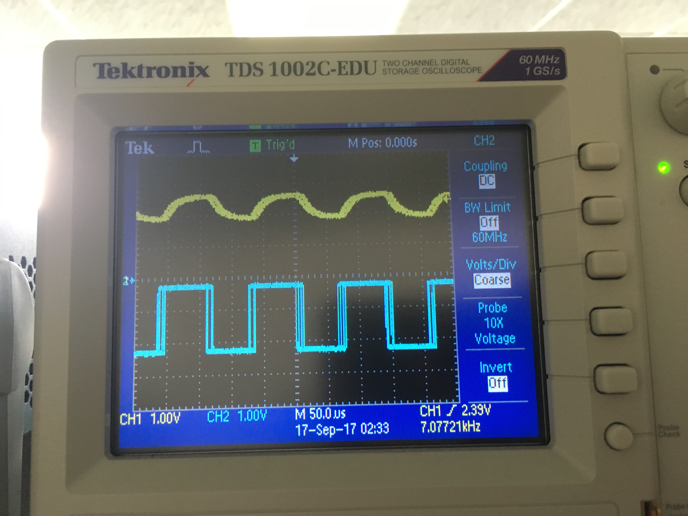
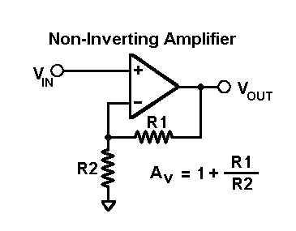
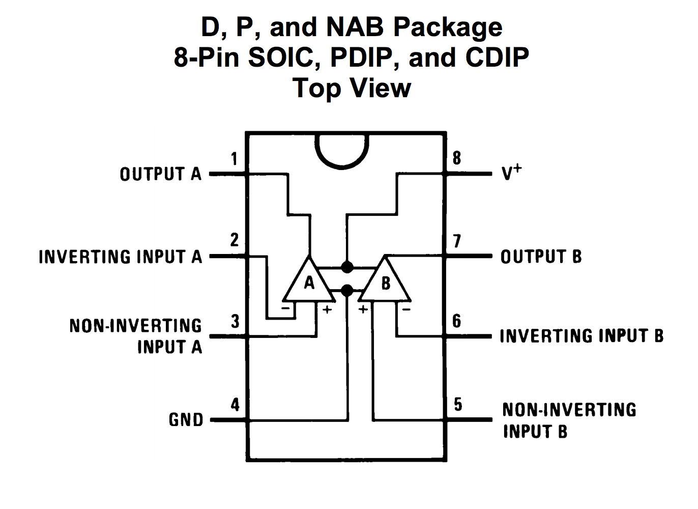
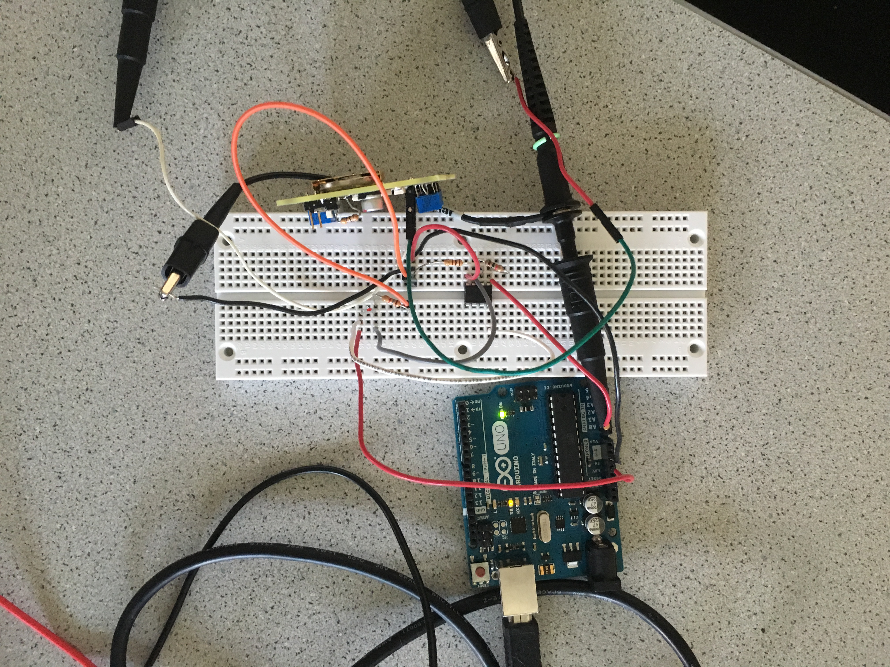

# Lab 2: Analog Circuitry and FFTs
Acoustic team: David Kim, Dylan Machado, Emmett Milliken

Optical team: Sofya Calvin, Amanda Trang


## Objective 
The goal of this lab was to get familiar with the microphone and the IR sensor that we would be adding to our robot. We did this by using the Open Music Labs Arduino FFT library to map the Fourier Transforms of the signals that the sensors were detecting. Additionally, we utilized op-amps to create filters and amplifiers for the audio and optical signals. In the future, these will be incorporated onto the robot to detect a 660Hz start signal as well as IR-emitting treasures throughout the map.

## Procedure
We initially split into two teams: Acoustic and Optical. The Acoustic team (David, Dylan, Emmett) focused on the microphone circuit, while the Optical team (Sofya, Amanda) worked with the IR sensor. Each team was to do the Fourier analysis corresponding to their circuit. As we did not finish during our lab hours, much of the lab was completed with varying members of the team during open lab.

### FFT analysis
For both the acoustic and optical parts of this lab, fast fourier transforms (FFT) were used to find the frequency content of the sampled input signal from the sensors. 

The FFT library takes in an analog signal, samples it, and calculates the frequency content. The maximum frequency that the fft can accurately detect is half of the sampling frequency.

The FFT takes in 256 samples taken at equally spaced intervals, and outputs 256 values that represent the frequency content of the input signal. The 256 output values are the calculated frequency content within certain bins, or range of frequencies. The FFT of a real signal is symmetric over zero, only half of the outputs are unique. This is why sets of 128 values are output to serial.

In order to visualize the data coming out of the arduino, we copied sets of the data from the serial window into Excel. We initially spent a fair bit of time trying to get MATLAB to display the frequency content in real time, but ended up not being very successful.

Our Excel graphs of the frequency content of our signals can be found later on this page.

### Amplifier/microphone circuit
When initially setting up the microphone, we were somewhat confiused by the diagram given to us:


We were confused because the microphone we had was already soldered on a board with other components.

After reviewing the FFT results, we determined a bandpass filter would be ideal to distinguish the 660Hz tone from environmental noise. After a series of failed trials and many exasperating hours later (e.g. a incorrectly wired bandpass filter, two or three correctly wired filters with excessive gains, a broken microphone, a faulty Arduino pin, etc.), we ultimately settled for a low-pass filter and high-pass filter back-to-back.

For reference, here is a selection of a few graphs of our attempts at running the FFT through the failed bandpass filters.



The following circuits are the filters we designed based on the gain, passbands, and stopbands we wanted. Using [Filter Wizard](http://www.analog.com/designtools/en/filterwizard/), we found the values for the components we would need.

Low-pass: 


High-pass: 


As the LM358 is a dual op-amp, we were able to include both circuits using the same board. The final circuit that we ended up using for the audio prortion of this lab is shown in the image below where the output of the microphone was put into the input of the low pass filter and the output of the low pass filter was then put into the high pass filter and finally the output of the high pass filter was connected to a capacitor and then the analog port of the arduino. The implementation was as follows:




### 660Hz tone detection
#### Before filter
Once we had succeeded in detecting individual frequencies, we forcused on getting a better idea of the actual range.

The Arduino Uno runs on a 16MHz clock. The ADC uses a prescaling value in order to slow down that clock to 16MHz/(prescaling factor). Changing the prescaling factor therefore lets us change the sampling frequency. Through looking at the documentation for the ATmega chip (http://www.atmel.com/Images/Atmel-42735-8-bit-AVR-Microcontroller-ATmega328-328P_Datasheet.pdf), along with careful reading of the example code and Team Alpha's website, we were able to figure out that we were using a prescaling factor of 32. This meant the clock for the ADC was running at 500kHz. The ATmega documentation says that an average ADC converstion takes 13 clock cycles to complete, so we would be sampling at around 38kHz. The size of each bin would then be around 150Hz. Our estimated bin size scale was about 146.666Hz, so they lined up fairly well.

 
 
#### After Filter

##### Capacitor VS No Capacitor:
 v1.jpg)
 v2.jpg)

The Capacitor was added right before the output signal was sent into the Arduino in order to cut the DC offset. As seen in the graphs above the one on the left was the circuit with the capacitor and the graph on the right was the circuit without a capacitor.
 

##### Different Prescalers:
 .jpg)
 .jpg)
 v2.jpg)
 
After building and connecting the filters to our circuit we were able to discover how to use the prescalers properly. The prescalers were preset to 32 from this line of code in the setup portion
 ```c
  ADCSRA = 0xe5; // set the adc to free running mode
```
and this line of code from the loop portion
```c
 ADCSRA = 0xf5; // restart adc
```
We were able to figure out that inorder to change the prescalers both the values needed to be changed and we changed the prescaler value to 128 by setting the ADCSRA like this:
 ```c
  ADCSRA = 0xe7; // set the adc to free running mode
 
  ADCSRA = 0xf7; // restart adc
 ```
We also figured out that as the prescaler value increases, the resolution increases, but the total range of measurable frequencies decreases. Therefore the graph would look like it is shifting to the right as shown in the graphs above.
 
##### Different Frequencies: 
 .jpg)
 .jpg)
 v1.jpg)
 
The capacitor in our circuit cuts the DC offset and prevents the signal from going down below 0V so the negative signals would be read as almost square waves and this causes the multiple peaks after the initial peak in the graphs above. 

##### Distinguish 660Hz from 590Hz and 730Hz
 .jpg)
 
 *Note: Actual bin numbers are the ones shown in the graph - 1, because we forgot to take into account that while graphing on excel the data started indexing at 2. So (660Hz: Bin 18; 590Hz: Bin 16; 730Hz: Bin 19)*
 
Once again we calculated the our actual sampling rate as we did before and found that we would be sampling at around 9.4kHz when we had our prescaler at 128. Therefore the size of each bin would then be around 36.87Hz. This calculation fits the bin numbers that the three different signals in the graph above fell into. Also the graph shows that we were able to distinguish the three signals apart from each other.

### IR sensor circuit
The goal of the Optical team was to detect a 7kHz IR beacon through the Arduino and perform a Fourier analysis on the signal. We first created a simple circuit (shown below) to detect the IR-emitting treasure. 




The operating principle of the phototransistor is that it allows more current to pass with the more light it receives; and, similarly, less current to pass with less light. We were able to test the functionality of this simple circuit by using the oscilloscope. The output voltage would correctly lower when the phototransistor was covered (i.e. exposed to no light). 

We set the treasures by attaching the output to the oscilloscope and adjusting the amplitude and frequency. This is indicated by channel 2 in blue in the image below. By holding the treasure against the phototransistor, we could see the effect in the output on the oscilloscope, as seen on channel 1 in yellow. The Fourier analysis will be discussed in the following section.



After initial testing, we determined that the signal received from the treasure was too weak at a realistic distance, and decided to implement an amplifier circuit. Using the LM358 op-amp and 1kΩ and 100Ω resistors, we created a simple non-inverting amplifier with a gain of approximately 10.




The actual implementation is as shown, with the treasure transmitting a signal at the top.



### IR treasure blinking at 7kHz, 12kHz and 17kHz
#### Before amplifier
After determining the circuit could detect the IR signal successfully (before the amplifier was implemented), we ran the data through the FFT from the Open Music Labs library. We worked off the example code offered on their site. We used the preset ADC clock prescalar 32 which is shown in the following line:

```c
  ADCSRA = 0xe5; // set the adc to free running mode
```

For this part of the lab we used the prescaler value of 32 because we were able to determine that if we used the value of 128 the signal at 17kHz would most likely be cutoff. 

We printed the output of the FFT to the Serial monitor and were then able to copy the data into Excel for visualization. In this set of data, we have two sets of data for each frequency the treasure was set to. 


")

#### After amplifier

Without modifying the code, we continued to collect data with the amplifier implementation. We can distinctly see the difference between the normal and the amplified signals, as there is a significantly higher amount of frequencies within the desired bins. We will likely use a similar implementation on the robot in the future.

Our measurements showed us that the 7kHz signal was in bin 48, the 12 kHz signal was in bin 81 and the 17kHz signal was in bin 114. Our bin size was calculated to be about 150 Hz(*[(16 MHz / 32 prescalar) / 13 clock cylces] / 256 bins.*). According to the calculated bin size and the bins that the signals seem to be placed in, in the graph shown below, the graph seems to be accurately detecting the treasures at each different signals.

.jpg)

The FFT code in its entirety can be viewed below:
(We used the example code that was provided to us to do this lab. The only part of the code that we modified was setting the prescaler values as mentioned in the seperate parts of the audio and optical parts).

```c
/*
fft_adc_serial.pde
guest openmusiclabs.com 7.7.14
example sketch for testing the fft library.
it takes in data on ADC0 (Analog0) and processes them
with the fft. the data is sent out over the serial
port at 115.2kb.
*/

#define LOG_OUT 1 // use the log output function
#define FFT_N 256 // set to 256 point fft

#include <FFT.h> // include the library

void setup() {
  Serial.begin(9600); // use the serial port
  TIMSK0 = 0; // turn off timer0 for lower jitter
  ADCSRA = 0xe5; // set the adc to free running mode
  ADMUX = 0x40; // use adc0
  DIDR0 = 0x01; // turn off the digital input for adc0
}

void loop() {
  while(1) { // reduces jitter
    cli();  // UDRE interrupt slows this way down on arduino1.0
    for (int i = 0 ; i < 512 ; i += 2) { // save 256 samples
      while(!(ADCSRA & 0x10)); // wait for adc to be ready
      ADCSRA = 0xf5; // restart adc
      byte m = ADCL; // fetch adc data
      byte j = ADCH;
      int k = (j << 8) | m; // form into an int
      k -= 0x0200; // form into a signed int
      k <<= 6; // form into a 16b signed int
      fft_input[i] = k; // put real data into even bins
      fft_input[i+1] = 0; // set odd bins to 0
    }
    fft_window(); // window the data for better frequency response
    fft_reorder(); // reorder the data before doing the fft
    fft_run(); // process the data in the fft
    fft_mag_log(); // take the output of the fft
    sei();
    Serial.println("start");
    for (byte i = 0 ; i < FFT_N/2 ; i++) { 
      Serial.println(fft_log_out[i]); // send out the data
    }
  }
}
```

[Return to home](https://sofyacalvin.github.io/ece3400-group3/)
