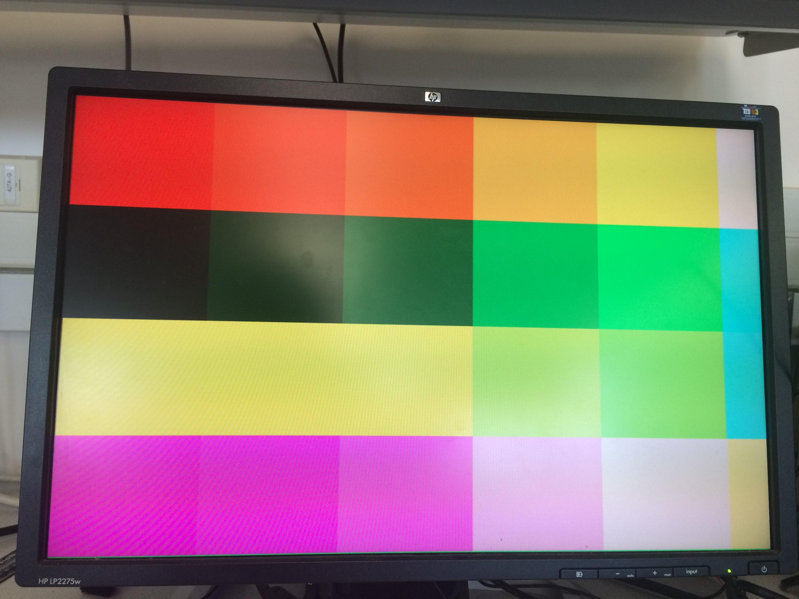
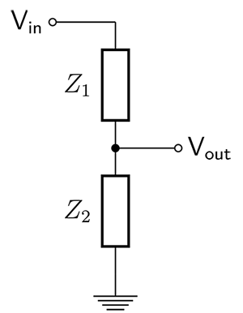
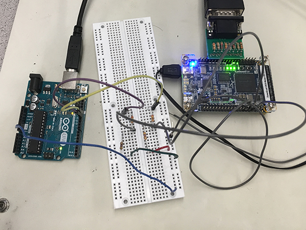
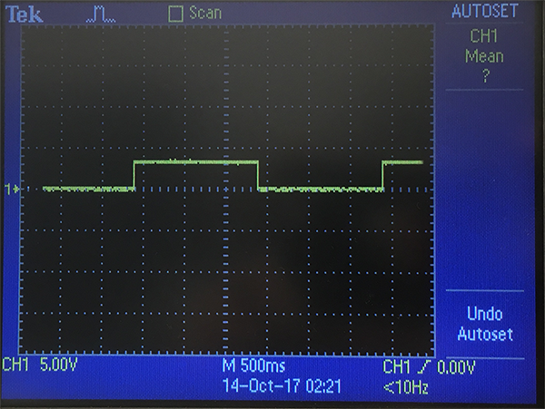
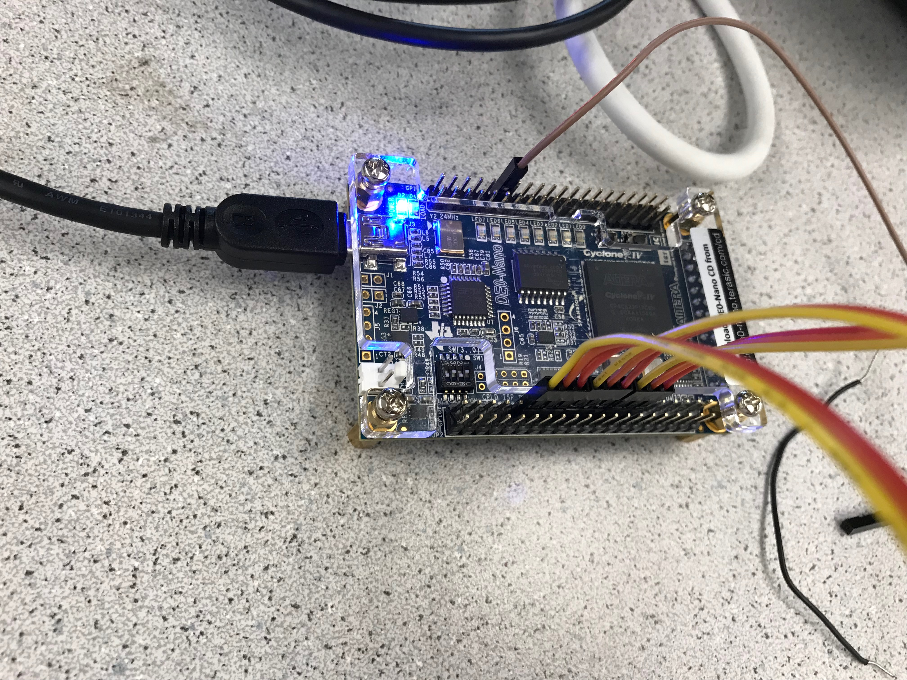
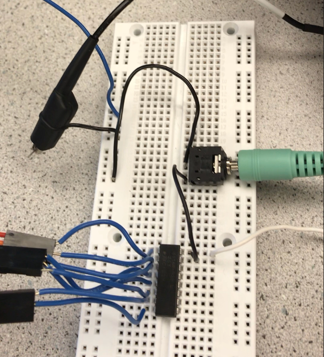

# Lab 3: FPGA Video Controller and Sound Generation
Graphics team: Sofya Calvin, Amanda Trang, Dylan Machado

Audio team: Emmett Milliken, David Kim

## Objective 
This lab has two main goals: one, to take external inputs from the Arduino to the FPGA and display them on a screen through VGA; and two, to generate a three-tone sound to a speaker via the 8-bit DAC. The graphics portion is intended to be a stepping stone toward a final goal of mapping the maze on-screen during competition, while the audio portion will eventually signal the completion of the maze.

## Procedure

### Graphics
#### DAC on VGA connectors

+ calculating resistor values

#### Drawing one box
To draw one box, we first designated in our code the pixel color we wanted.

``` assign PIXEL_COLOR = 8'b000_111_00; // Green```

The program then looped through each pixel and changed all them to that one designated color. Since they were all one color, there was no need to create an array to keep track of each pixel. They were all the same. 


#### Updating array dependent on inputs
The next goal was to split the pixels up to display multiple colors on the screen. To do this, we split up our box into groups via a series of case statements.

```
 always @ (posedge CLOCK_50) begin
	 		case(PIXEL_COORD_Y / 120)
			4'd0 : 												// row A
				case(PIXEL_COORD_X / 120)
					4'd0 : PIXEL_COLOR = 
					8'b111_000_00;
					4'd1 : PIXEL_COLOR = 8'b111_001_00;
					4'd2 : PIXEL_COLOR = 8'b111_010_00;
					4'd3 : PIXEL_COLOR = 8'b111_100_00;
					4'd4 : PIXEL_COLOR = 8'b111_110_00;
					4'd5 : PIXEL_COLOR = 8'b111_111_01;
					default: PIXEL_COLOR = 8'b111_111_11;
					endcase
...
 end
 ```

With the case statements, we first divided our set of pixels into rows, from row A to row D. From there, we looked at the the remaining X coordinate values of the pixels and divided them into further columns. This gave us boxes that could each contain a unique color that we designated. The result was a colorful grid on our screen, seen below.



#### Reading external inputs to FPGA

With an objective of taking in at least two inputs from the Arduino, we took a simple route of outputting toggling digital signals from the Arduino on loop. Outputting to digital pins 12 and 13, we alternated between sending (0,0), (0,1), (1,0), and (1,1) with 1.5 second intervals. This would create the desired four states.

```arduino
void loop() {
  // put your main code here, to run repeatedly:
  digitalWrite(pin1, LOW);
  digitalWrite(pin2, LOW);
  delay(1500);
  digitalWrite(pin1, LOW);
  digitalWrite(pin2, HIGH);
  delay(1500);
  digitalWrite(pin1, HIGH);
  digitalWrite(pin2, LOW);
  delay(1500);
  digitalWrite(pin1, HIGH);
  digitalWrite(pin2, HIGH);
  delay(1500);
}
```

We also knew the Arduino runs on a 5V scale, whereas the FPGA uses 3.3V. We designed a simple voltage divider to pull down the voltage as follows:



Where Z1 (R1) was 240Ω, ad Z2 (R2) was 470Ω. These values were calculated using [Ohms Law Calculator](http://www.ohmslawcalculator.com/voltage-divider-calculator). We connected the pins from the Arduino to this circuit, and the output of the voltage divider to the FPGA. The system looked as follows:



We wanted to ensure our signal was toggling as desired, so we hooked it up to the oscilloscope to view the signals from each pin. The oscilloscope showed us that it was toggling as desired:



In order to check if our signals were being read correctly, we wrote the LEDs on the FPGA to toggle in accordance with the two signals (i.e. LED1 turned on when switch_1 (from the Arduino) went high, and the same thing for LED2 and switch_2). The debugging process of this is described later in this report. The following is a quick clip of what the LEDs looked like with the toggling signal:

[](http://www.youtube.com/watch?v=l2PiRnfkoK0)

The left two blinking LEDs correspond to the changing signals, while the rightmost LED blinking was from the Lab 3 template code, in order to show it was running.

#### Mapping external inputs on screen

Wanting to use these signals to change the colors on-screen, we returned to Quartus to modify the existing colored grid code. Out of simplicity, we modified the first square on the first two rows--turning them white when its respective signal went high.

```verilog
always @ (posedge CLOCK_50) begin
	case(PIXEL_COORD_Y / 120)
		4'd0 : 									// row A
			case(PIXEL_COORD_X / 120)
				4'd0 : PIXEL_COLOR = (switch_1) ? 8'b111_111_11: 8'b111_000_00;

...

		4'd1 : 									// row B
			case(PIXEL_COORD_X / 120)
				4'd0 : PIXEL_COLOR = (switch_2) ? 8'b111_111_11: 8'b111_111_00;			
```

This gave us four different states: neither square being white (0,0), one white with one colored (0,1) or (1,0), and both white (1,1). Here is a video of the toggling squares:

[](http://www.youtube.com/watch?v=GtVpXq7ru7g)

We additionally wanted to have four different squares change colors, for the clear distinction of the four different states. We changed the square A1 (top left) to turn white on (0,0), B1 white on (0,1), C1 white on (1,0), and D1 (bottom left) on (1,1). 

```verilog
4'd0 : 											// row A
	case(PIXEL_COORD_X / 120)
		4'd0 : PIXEL_COLOR = (~switch_1 && ~switch_2) ? 8'b111_111_11: 8'b111_000_00;

...

4'd1 : 											// row B
	case(PIXEL_COORD_X / 120)
		4'd0 : PIXEL_COLOR = (~switch_1 && switch_2) ? 8'b111_111_11: 8'b111_111_00;					

...

4'd2 : 											// row C
	case(PIXEL_COORD_X / 120)
		4'd0 : PIXEL_COLOR = (switch_1 && ~switch_2) ? 8'b111_111_11: 8'b111_111_00;

...

4'd3 : 											// row D
	case(PIXEL_COORD_X / 120)
		4'd0 : PIXEL_COLOR = (switch_1 && switch_2) ? 8'b111_111_11: 8'b111_000_11;
```

[](https://www.youtube.com/watch?v=NvecpIrvSZ8)

Debugging: 

We had a few issues with using the correct pins on the FPGA. We first didn't distinguish between GPIO_0 and GPIO_1, and then did not know the correct orientation of the pinout (i.e. where pin 1 was), then could not interface with the pin itself. 


From the oscilloscope check, we were confident the signal was toggling as desired at 3.3V. Then, we tried debugging using the LEDs on the FPGA. After a series of seeing the LEDs constantly high for some arbitrary reason, we realized we were not, in fact, reading from GPIO_1 pins 15 and 17, but rather 5 and 7--the declaration of the "_1" in "GPIO_15" was confusing.

After this, we switched to outputting on the screen. Our logic had been correct to change boxes on-screen.


### Audio
#### Connecting the FPGA output to the the speaker
The DAC was connected to the FPGA GPIO 1 pins for this part of the lab. We had the output from the sine wave output from the even numbered pins of GPIO_1 pins 8 through 22. Then the output of the DAC was connected to the speakers as shown in the pictures below.





To make sure that our connection was working properly we first wrote out the code that outputed a 660hz sine wave. The code that was used was similiar to the 440hz square wave code. However we created a new module in the project in verilog called SINE_ROM that would read in the sine values from a text file that we generated and store the values as a ROM. Then we created an instance of the module in the main file and connected the inputs and outputs the way we wanted it to be. 

```verilog
SINE_ROM sine  (
		.addr(address),
		.clk(CLOCK_25),
		.q({GPIO_1_D[8],GPIO_1_D[10],GPIO_1_D[12],GPIO_1_D[14],GPIO_1_D[16],GPIO_1_D[18],GPIO_1_D[20],GPIO_1_D[22]})
	       );
```
Then we had a varable that represented the time, in clock cycles, it would wait before the next address access in the sine table.

```verilog
//660hz sine wave
localparam CLKDIVIDER_660 = 25000000/660/256;
```
The algorithm that we used was having a counter decrementing to 0, and when the time reached 0 the program would read the next value in the sine table. And the counter would be reset to the value in the local variable CLKDIVIDER_660. We had the counter decrementing every posedge of the CLK. 

```verilog
/* 660 hz sine wave */	 
always @ (posedge CLOCK_25) begin
 if (counter == 0) begin
   counter <= CLKDIVIDER_660 - 1;
   if (address == 255) begin
     address <= 0;
   end
   else begin
   address <= address + 1;
   end
 end
 else begin
   counter <= counter - 1;
 end
end
```

[](https://www.youtube.com/watch?v=ROW6aC9uuBA)

#### Outputting a square wave to the speaker
We first used the template code that was provided to us and followed the example that team alpha had on their website.
The following is the code that we added to the DE0_NANO template.
```verilog
//time for 440hz square wave
localparam CLKDIVIDER_440 = 25000000/440/2;

...
	
// Sound variables
reg square_440;                       // 440 Hz square wave
assign GPIO_0_D[2] = square_440;

...
   
//Sound state machine (440hz square wave)
always @ (posedge CLOCK_25) begin
  if (counter == 0) begin
    counter    <= CLKDIVIDER_440 - 1; // reset clock
    square_440 <= ~square_440;        // toggle the square pulse
  end
  else begin
    counter    <= counter - 1;
    square_440 <= square_440;
  end
end	
```
after we ran the code on the DE0-NANO we connected the output to the oscilloscope and got the output that we were expecting.


#### Outputting three tones via DAC
For outputting three distinct tones, we took 2 different approaches. At first we thought that we were supposed to output 3 seperate frequencies at the same time. So we started working on that approach. However, it proved difficult because there was a problem with assigning the outputs of 3 different modules to the same pins that we used for the output that was set up (GPIO1 even pins 8 - 22). 
Then we were told that the task was to output 3 different frequencies, one at a time. So we fixed up our code to do this, with came out to be a lot simpler. 

First we found some different frequencies that we wanted to output. 
```verilog
//notes in Dm11 chord
localparam CLKDIVIDER_D = 25000000/294/256;
localparam CLKDIVIDER_F = 25000000/349/256;
localparam CLKDIVIDER_A = 25000000/440/256;
localparam CLKDIVIDER_C = 25000000/523/256;
localparam CLKDIVIDER_E = 25000000/660/256;
localparam CLKDIVIDER_G = 25000000/784/256;
```
Next we added 2 more variables one called duration to make sure that each frequency plays for one sec at a time and the other one called note to keep track of which of the three tones were currently playing. 

Then we coded the whole program similiarly to the 660 hz sine output. However we had more conditions that were checking this time. One additional condition checked that the if the duration decremented down to 0 it would reset it to the value that is ONE_SEC and also it would change the tone that was currently playing. The second additional condition that we added was to check which note was currently playing and which note to change to.

```verilog
/* 3 distinct tones played for 1 sec at a time*/ 
always @ (posedge CLOCK_25) begin
  if (duration == 0) begin
    duration <= ONE_SEC;
    if (note == 0) begin
      count <= CLKDIVIDER_C - 16'b1;
      note <= 2;
    end
    else if (note == 1) begin
      count <= CLKDIVIDER_G - 16'b1;
      note <= note - 2'b1;
    end
    else if (note == 2) begin
      count <= CLKDIVIDER_E - 16'b1;
      note <= note - 2'b1;
    end
  end
  else begin
    if (counter == 0) begin
      counter <= count - 16'b1;
      if (address == 255) begin
        address <= 8'b0;
      end
      else begin
        address <= address + 8'b1;
      end
    end
    else begin
      counter <= counter - 16'b1;
    end
    duration <= duration - 25'b1;
  end
end
```

[](https://www.youtube.com/watch?v=UuwHNSVr4Zk)

After we finished this part of the lab we went back to our first approach where we would output 3 tones at the same time because it seemed interesting. 
With the help of the TA we figured out that we needed three seperate modules (one for each frequency) and we would have to have 3 temporary output reg for the 3 modules. 
```verilog
//multifrequency output
SINE_ROM sine1 (
		.addr(address1),
		.clk(CLOCK_25),
		.q(out1)
	       );
	 
SINE_ROM sine2 (
		.addr(address2),
		.clk(CLOCK_25),
		.q(out2)
	       );

SINE_ROM sine3 (
		.addr(address3),
		.clk(CLOCK_25),
		.q(out3)
	       );
```

Then we would add up the 3 outputs of the seperate modules and divide it by 3 to take care of possible very high amplitude from the sum of the three outputs and then output it to the FPGA board. 

The setup of the output was a little tricky at first but we figured out that we needed to assign the desired output pins:
```verilog
//for multifrequency output
reg[7:0]   final;

assign {GPIO_1_D[8],GPIO_1_D[10],GPIO_1_D[12],GPIO_1_D[14],GPIO_1_D[16],GPIO_1_D[18],GPIO_1_D[20],GPIO_1_D[22]} = final;
```
Then we had 3 seperate always blocks that were for each of the 3 tones we wanted. In these always blocks we had the code for going through the sine table. The only thing that would be different would be the desired tone variable. 
```verilog 
always @ (posedge CLOCK_25) begin
  if (counter1 == 0) begin
    counter1 <= CLKDIVIDER_E - 1;
    if (address1 == 255) begin
      address1 <= 0;
    end
    else begin
      address1 <= address1 + 1;
    end
  end
  else begin
    counter1 <= counter1 - 1;
  end
end
```
Then this last always block would combine the outputs of the three seperate tones
```verilog
always @ (posedge CLOCK_25) begin
  if (counter == 0) begin
    counter <= CLKDIVIDER_G - 16'b1;
    final <= ((out1 + out2 + out3 )/3);
  end
  else begin
    counter <= counter - 16'b1;
  end
end
```
Although, the outputting sound was not very clean this seemed to work to a certain extent. If we have more time we will try to output a more pleasent and cleaner sounding chord.

[](https://www.youtube.com/watch?v=U1iU36uOmO8)


[Return to home](https://sofyacalvin.github.io/ece3400-group3/)
