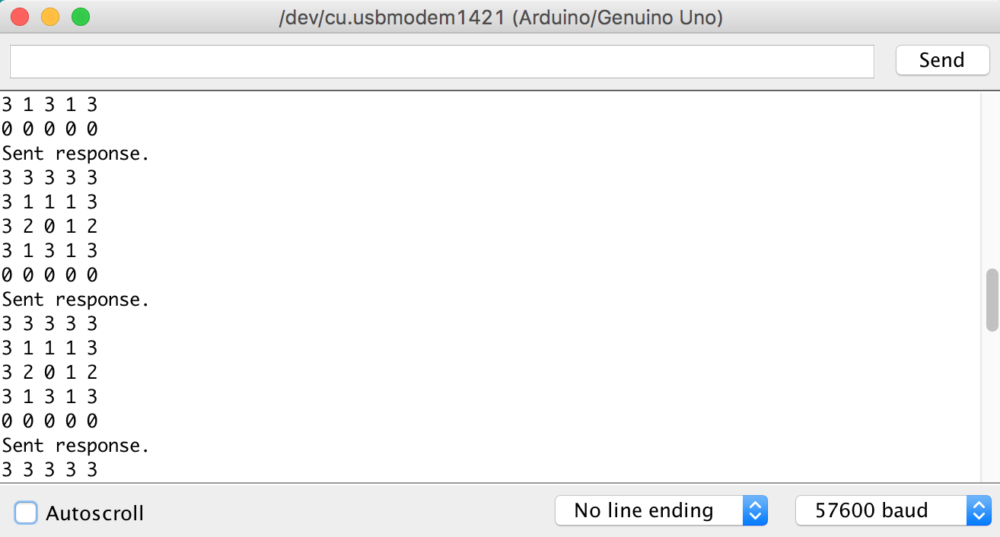
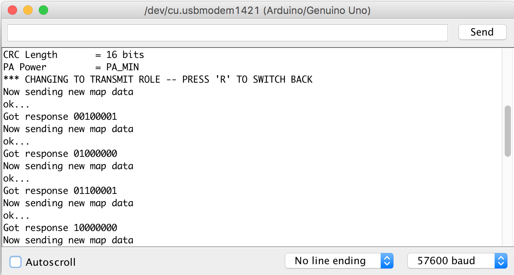
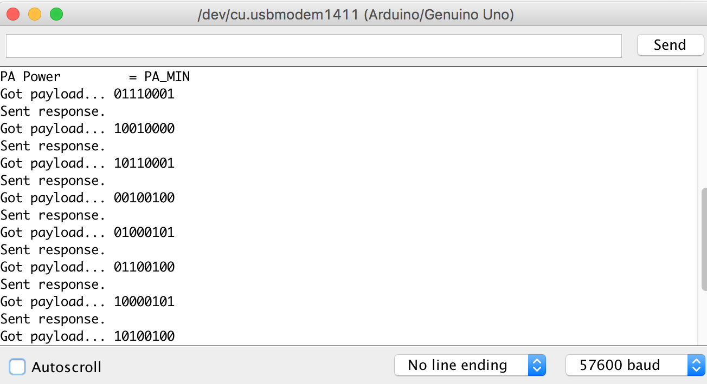

# Lab 4: Radio Communication and Map Drawing
Radio team: Sofya Calvin, Amanda Trang, Dylan Machado

FPGA team: Emmett Milliken, David Kim

## Objective 
The objective of this lab was to implement radio communication between two Arduinos--which will later be implemented as radio communication between the robot and our base station. An additional component was integrating the work from Lab 3 to display updated maze data through VGA, requiring the states of the visited areas to be stored.

## Procedure

### Radio

#### Wireless sending between Arduinos
The majority of the wireless communication was implemented through the template code provided in GettingStarted and the RF24 library. We first calculated the identifier numbers for our pipes using the *2(3D + N) + X* formula provided. As Day 0 and and Team 3, our identifier values came out to be 6 and 7.

```
const uint64_t pipes[2] = { 0x0000000006LL, 0x0000000007LL };
```

The message (by default, set to a timestamp) is put into radio.write() in order to send it to the other, receiving radio. This transmitter then waits for a response (i.e. acknowledgement) that the data had been received correctly. Additionally, the ACK bit is already implemented. To receive the data, while it is not "done," radio.read() receives the data, which can be printed to the serial monitor.

Putting this program on both Arduinos and setting one to T(ransmit) and the other to R(eceive), we were able to view the timestamps of the messages on both serial monitors. 

#### Sending whole maze
Sending the whole maze wirelessly was a fairly minor addition to the GettingStarted.ino template code. We started by defining an arbitrary 2D maze array and sent the maze in a single payload:

```
unsigned char maze[4][5] =
    {
      0, 0, 1, 2, 3,
      2, 2, 0, 1, 2,
      1, 1, 3, 2, 2,
      1, 1, 2, 0, 1,
    };

    // Send the maze
    printf("Now sending the maze...\n");
    bool ok = radio.write(maze, sizeof(maze));
    
    if (ok)
      printf("ok...");
    else
      printf("failed.\n\r");
    
    // Now, continue listening
    radio.startListening();
```

Again, radio.write() does the heavy lifting of it, sending the data and assigning *ok* to true or false, printing the response accordingly. On the receiving end of things, we radio.read() the received data (called *got_maze*), printing it to the serial monitor by interating through the entire 2D array. The serial monitor looked as follows:




```
unsigned char got_maze[5][5];
      bool done = false;
      while (!done)
      {
        // Fetch the payload.
        done = radio.read( got_maze, sizeof(got_maze) );
      
        // Print the maze
        for (int i=0; i < 5; i++) {
          for (int j=0; j < 5; j++) {
            printf("%d ", got_maze[i][j]);
          }
          printf("\n");
        }
      
        // Delay just a little bit to let the other unit
        // make the transition to receiver
        delay(20);
```        

#### Sending new data
Sending the whole maze on each loop is evidently not the most efficient way to do it--particularly in relation to power consumption, if this were a larger-scale project. Instead, we chose to send only new, changing data (i.e. new position, discovered treasure, etc.). By initializing x and y coordinate variables as well as a "state" variable (called *x_coord, y_coord* and *pos_data* respectively), we will be able to simple increment the desired values to display the robot's position.

|   | 0          | 1          | 2          | 3          | 4          |
|---|------------|------------|------------|------------|------------|
| 0 | 000 00 xx | 001 00 xx | 010 00 xx | 100 001 xx | 101 001 xx |
| 1 | 000 01 xx | 001 01 xx | 010 01 xx | 100 010 xx | 101 010 xx |
| 2 | 000 10 xx | 001 10 xx | 010 10 xx | 100 011 xx | 101 011 xx |
| 3 | 000 11 xx | 001 11 xx | 010 11 xx | 100 100 xx | 101 100 xx |

This table is the binary representation of our 4x5 grid. 

To send the new data, we created a new variable (called *new_data*) as the packet to send to the base station. This is a 7-bit piece of information, in which the first three bits display the x position, the next two are y position, and the last two are state data. This was chosen as the grid is 5 wide, requiring 3 bits to describe each, but only 4 tall--requiring 2 bits. For testing purposes, we arbitrarily made 4 states, which also required 2 bits. In order to display the data this way, we shift the x and y position data to fit next to the data. The debugging for the packet data is described later in this report.

```
new_data = x_coord << 4 | y_coord << 2 | pos_data;
// x x x | y y | d d
```

To actually send this data, we follow a similar process in sending the whole maze. We send the new data through radio.write() again. 

```
printf("Now sending new map data\n");
bool ok = radio.write( &new_data, sizeof(unsigned char) );

if (ok)
  printf("ok... \n");
else
  printf("failed.\n\r");

// Now, continue listening
radio.startListening();
```

The sending side of the Serial Monitor looks as follows:



To verify the data being transmitted and received, we simply read the data back and parse the string back into bits--which may not be the most efficient way to do it, but made debugging much simpler by seeing the binary represenation of the packet instead of binary.

```
String got_string = String(bitRead(got_data_t, 6)) + String(bitRead(got_data_t, 5)) + String(bitRead(got_data_t, 4)) + " " + String(bitRead(got_data_t, 3)) + String(bitRead(got_data_t, 2)) + " " + String(bitRead(got_data_t, 1)) + String(bitRead(got_data_t, 0));
// Spew it
Serial.println("Got response " + got_string);
```

On the receiving end, we similarly declare the variable of the data received (*got_data*) and verify if it was receieved. Using radio.read() we are able to take that data, print the result to the serial monitor.  The Serial Monitor for this is as follows:



```
unsigned char got_data;      
bool done = false;
while (!done) {
  // Fetch the payload, and see if this was the last one.
  done = radio.read( &got_data, sizeof(unsigned char) );
  // Spew it
  // Print the received data in binary
  String bin_string = String(bitRead(got_data, 6)) + String(bitRead(got_data, 5)) + String(bitRead(got_data, 4)) + " " + String(bitRead(got_data, 3)) + String(bitRead(got_data, 2)) + " " + String(bitRead(got_data, 1)) + String(bitRead(got_data, 0));
  printf("Got payload... ");
  Serial.println(bin_string);
  // Delay just a little bit to let the other unit
  // make the transition to receiver
  delay(20);
```

For now, we are simulating exploration by methodically incrementing the data to travel the entire grid. The data is then sent to the FPGA.

Debugging:

We ran into some issues using the digital pins on the Arduino. We mistakenly attempted to utilize digital pins 0 and 1 as GPIO--however, they are TX and RX, meant for serial communication. The data transmission between the Arduino and FPGA became questionable due to our parallel implemenation. Without pins 0 and 1, we were forced to use a 7-bit packet (from pins 2-8). 

### FPGA

#### Displaying full 4x5 grid
As in lab 3, we split the screen into rows and then columns using nested case statements. These nested case statements create the necessary 4x5 grid and allow us to set the pixel color within each square. Previously the color had been hard coded, but now is determined by data sent from the Ardiuno.
In order to store the incoming data, we created a 4x5 array of 2-bit values. This array is updated every time the FPGA recieves information from the Arduino. 

#### Arduino and FPGA maze communication

#### Displaying exploration


[](http://www.youtube.com/watch?v=QG6HxMM3Pq4)

[](http://www.youtube.com/watch?v=UZrElPKMoSs)

[Return to home](https://sofyacalvin.github.io/ece3400-group3/)
