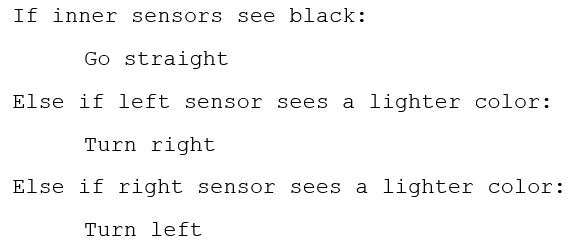
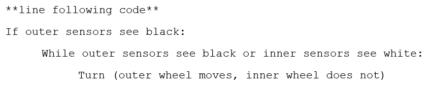
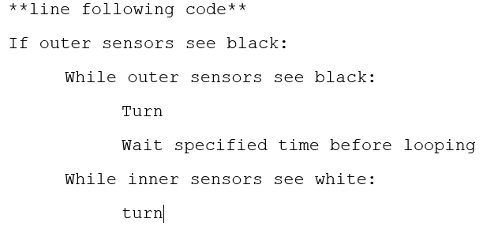

# Milestone 1

For Milestone one, our team was required to create a robot which had the ability to follow a black line using sensors, as well as complete a figure 8 motion when placed on a grid. 

## Following a Line

For the first part of the milestone, we had to figure out how to make our robot follow a line. We determined that the best way to approach this was to use sensors to read and track the line as the robot follows it. This means we were faced with two challenges: the placement and usage of sensors to detect the line, and the act of remaining on the line and following it as the robot moves.

### Hardware

The first challenge in creating the robot from scratch was to make it mobile. We decided that we would start off using the servos as motors and eventually, if we see it to be a problem, will consider swapping these out for more precise and controllable motors. To build the robot was fairly straight forward: we attached the servos to a set of wheels, which were then secured to a plastic base with a third leg for support. On top of the base, we attached an Arduino Uno and circuit board for all of the wiring and programming. Finally, we attached two light sensors on the front of the robot to help with guiding it. 

To make the robot follow a line, we relied on the values reported on the light sensors in (almost) real time. When the value read less than ~900, this indicated the sensor was over white area. When the value read greater than ~950, this indicated the sensor was over black area. At first we left a little space between the two sensors to give the robot a wide range of "vision". However, after running the robot in a trial round, we realized that it was correcting its motion too much and wiggling around the line instead of following it directly. To fix this, we moved the sensors closer together so that once it corrected its motion, it would stay on the line and not continue to wiggle. 

As far as power sources were concerned, we used a typical phone charger to power the servos and a regular 9V battery to power the Arduino. From the Arduino, we used the 5V output as a power source for the light sensors. The remaining wiring involved connecting the hardware to ground, as well as connecting the servos to Arduino outputs and the servos to Arduino inputs. 

### Software

To make our robot follow a line, we coded a way for the robot to utilize the two center sensors in front. First, we obtained data from the sensors to determine the values of white and black. From there, we created an algorithm represented by this pseudocode:

With this, if one sensor went off of the line, the robot would turn and correct itself to have both sensors over it again.

### Results

The video above shows our robot in action. It correctly follows a line, and corrects itself as it moves. However, we noticed that the robot had issues with remaining in a straight line, and felt that the turns were too jolting and unnecessarily slowed down the robot. It turned out that we initially failed to have a common ground for our servos, which resulted in them moving at different speeds. We also decided to have the robot use only one wheel at a time when adjusting so that the robot was always moving forward on a line, instead of pivoting to adjust. The final iteration can be seen below.

With the first part done, we were ready to move on to the next step.

## Figure 8

For the figure 8, we faced several more challenges. The robot needed to follow a line, but it also needed to turn at and cross specific junctions. To do this, we needed the robot to determine where these junctions were, and how to act at these junctions.

### Hardware

To modify the robot to move in a figure 8 motion, we decided to add two more sensors to the robot. The initial two that we had placed on the robot, functioned primarily to keep the robot following the line. The additional two sensors we added were used solely to detect the intersections. To do this, we made sure to place them towards the sides of the robot so that they would not detect the line that the robot was following, but would detect the intersections. This was crutial in developing the code to perform this task.

### Software

The first task in coding our figure 8 program was implementing our line following algorithm. After that, we needed to tell the robot when it reached a junction, and what to do. Through the outer sensors, we were able to tell the robot when a "new action" was to be taken. The robot would then follow a loop of commands to determine whether that action was a turn or driving through an intersection.

For our turns, we first tried using an algorithm similar to this:

However, this proved to be unreliable. The robot would often begin turning but not complete the turn, or not turn at all. To fix this issue, we changed our code to implement a delay before the sensors would read new values. As a result, our robot was much more reliable.

### Results

The video above shows our working, but unoptimized figure 8 build. We changed our turns to use both wheels (the outer wheel moves faster than the inner wheel to keep the turn sharp but not on a pivot) as well as moving our outer junction-detecting sensors back to compensate for quicker, sharper turns. Below is a video of our final implementation.

