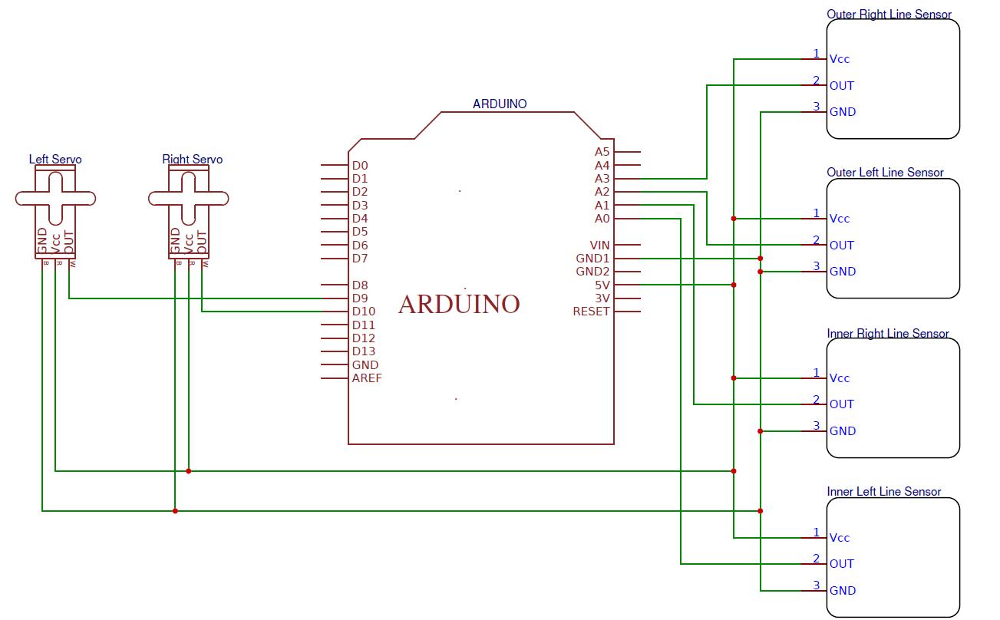

# Milestone 1

For Milestone one, our team was challenged to create a robot which had the ability to follow a black line using sensors, as well as complete a figure 8 motion when placed on a grid. This required an in depth analysis of mechanics, hardware, and software. 

## Following a Line

For the first part of the milestone, we had to figure out how to make Brooklynn follow a line. We determined that the best way to approach this was to use sensors to read and track the black line as she followed it. This meant we were faced with two challenges: the placement and usage of sensors to detect the line, and the act of remaining on the line and following it as she moved.

### Hardware

The first challenge in designing Brooklynn from scratch was to make her mobile. We decided that we would start off using the servos as motors and eventually, if we see it to be a problem, will consider swapping these out for more precise and controllable motors. To build Brooklynn was fairly straight forward: we attached the servos to a set of wheels, which were then secured to a plastic base with a third leg for support. On top of the base, we attached an Arduino Uno and circuit board for all of the wiring and programming. Finally, we attached two light sensors on the front of Brooklynn to help with guiding her. 


To make Brooklynn follow a line, we relied on the values reported on the light sensors in (almost) real time. When the value read less than ~900, this indicated the sensor was over white area. When the value read greater than ~950, this indicated the sensor was over black area. At first we left a little space between the two sensors to give Brooklynn a wide range of "vision". However, after running her in a trial round, we realized that she was correcting her motion too much and wiggling around the line instead of following it directly. To fix this, we moved the sensors closer together so that once she corrected her motion, she would stay on the line and not continue to wiggle. 

As far as power sources were concerned, we used a typical phone charger to power the servos and a regular 9V battery to power the Arduino. From the Arduino, we used the 5V output as a power source for the light sensors. The remaining wiring involved connecting the hardware to ground, as well as connecting the servos to Arduino outputs and the servos to Arduino inputs. 

### Software

To make Brooklynn follow a line, we coded a way for her to utilize the two center sensors in front. First, we obtained data from the sensors to determine the values of white and black. From there, we created an algorithm represented by this pseudocode:


With this, if one sensor went off of the line, Brooklynn would shift and correct herself to have both of her middle sensors over the line again.

The full code can be found at the bottom of this page.

### Results

[](http://www.youtube.com/watch?v=RP49caLh4oo)

The video above shows Brooklynn in action. She correctly follows a line, and corrects herself as she moves. However, we noticed that she had issues with remaining in a straight line, and felt that the turns were too jolting and unnecessarily slowed her down. It turned out that we initially failed to have a common ground for our servos, which resulted in them moving at different speeds. We also decided to have Brooklynn use only one wheel at a time when adjusting so that she was always moving forward on a line, instead of pivoting to adjust. The final iteration can be seen below.

[](http://www.youtube.com/watch?v=3n7LCLbF0UE)

With the first part done, we were ready to move on to the next step.

## Figure 8

For the figure 8, we faced several more challenges. Brooklynn needed to follow a line, but she also needed to turn at and cross specific junctions. To do this, we needed her to determine where these junctions were, and how to act at these junctions.

### Hardware

To modify Brooklynn to move in a figure 8 motion, we decided to add two more sensors to her. The initial two that we had placed on her functioned primarily to keep her following the line. The additional two sensors we added were used solely to detect the intersections. To do this, we made sure to place them towards the sides of Brooklynn so that they would not detect the line that she was following, but would detect the intersections. This was crutial in developing the code to perform this task.


The final hardware wiring for Milestone 1 is depicted by the following schematic:



### Software

The first task in coding our figure 8 program was implementing our line following algorithm. After that, we needed to tell Brooklynn when she reached a junction, and what to do. Through the outer sensors, we were able to tell her when a "new action" was to be taken. She would then follow a loop of commands to determine whether that action was a turn or driving through an intersection.

For our turns, we first tried using an algorithm similar to this:


However, this proved to be unreliable. Brooklynn would often begin turning and not complete the turn, or not turn at all. To fix this issue, we changed our code to implement a delay before the sensors would read new values. As a result, Brooklynn was able to respond much more reliably at intersections.


The entire code can be found at the bottom of the page

### Results

[](http://www.youtube.com/watch?v=FGEi17X3DoE)

The video above shows our working, but unoptimized figure 8 build. Eventually, we changed our turns to use both wheels (the outer wheel moves faster than the inner wheel to keep the turn sharp but not on a pivot) as well as moving our outer junction-detecting sensors back to compensate for quicker, sharper turns. Below is a video of our final implementation.

[](http://www.youtube.com/watch?v=lCFXg24FKVM)

### Line Following Code

```c
#include <Servo.h>


Servo leftservo;
Servo rightservo;
void setup() {
  // initialize serial communication at 9600 bits per second:
  Serial.begin(9600);
  pinMode(9,OUTPUT);
  pinMode(10,OUTPUT);
  
  leftservo.attach(9);
  rightservo.attach(10);

  
}

// the loop routine runs over and over again forever:
void loop() {
  // read the input on analog pin 0:
  int sen1 = analogRead(A0);
  int sen2 = analogRead(A1);
 /*Serial.print(sen1); //
 Serial.print(F("  "));
 Serial.println(sen2);*/


 if (abs(sen1-sen2)<75){
 leftservo.write(180);
 rightservo.write(0);
 }
 else if (sen1>sen2){ //tilted to the right; right sensor senses white
 leftservo.write(90);
 rightservo.write(0);
 }
 else if (sen2>sen1){ //tilted to the left; left sensor senses white
  leftservo.write(180);
  rightservo.write(90);
 }
 
  
}
```
### Figure 8 Code

```c
#include <Servo.h>
int rightTurn;
int leftTurn;

int inLeft;
int inRight;
int outLeft; 
int outRight;
int stepCounter;

Servo leftservo;
Servo rightservo;

void setup() {
  // initialize serial communication at 9600 bits per second:
  Serial.begin(9600);
  leftservo.attach(9);
  rightservo.attach(10);

  rightTurn = 0;
  leftTurn = 0;
  stepCounter = 1;
  
}

// the loop routine runs over and over again forever:
void loop() {
  
  // read the input on analog pin 0:
  
  //light sensors
  //(>950 : black line ; <900 : white space)
  readSensor();
  
  // --------------
  // LINE FOLLOWING start
  // --------------
  while (outLeft < 900 || outRight < 900){ //while both outer sensors see white
    readSensor();
    
    if (abs(inLeft-inRight)<70){ //if inner are similar
      forward();
      
    }
    else if (inLeft>inRight){ //if tilted left, correct
       leftservo.write(90);
       rightservo.write(0);
    }
    else if (inRight>inLeft){ //if tilted right
      leftservo.write(180);
       rightservo.write(90);
    } 

    readSensor();
  }

  stop();
 //-------------
 //end line follow section
 //-------------

 
//--------------
//steps when intersection is encountered section, start
//--------------
  switch(stepCounter){
    case 1://for first 3 detected intersections, turn right
    case 2:
    case 3:
        right();
        delay(500);
        while(outLeft > 900 || outRight > 900) { //while out sees black, in sees white
          right();
        }
        while(inLeft < 900 && inRight < 900) { //while out sees black, in sees white
          right();
        }
        stepCounter++;
        break;
    case 4: //go straight after 3 right turns
        forward();
        delay(500);
        stepCounter++;
        break;
    case 5://turn left at next 3 intersections
    case 6:
    case 7:
        left();
        delay(500);
        while(outLeft > 900 || outRight > 900) { //while out sees black, in sees white
          left();
        }
        while(inLeft < 900 && inRight < 900) { //while out sees black, in sees white
          left();
        }
        stepCounter++;
        break;
     case 8://go straight after 3 left turns
        forward();
        delay(500);
        stepCounter=1;
        break;
     default:
        break;
  }
}

void readSensor(){
  inLeft = analogRead(A0);
  inRight = analogRead(A1);
  outLeft = analogRead(A2);
  outRight = analogRead(A3);
}
//turning functions
void forward() {
  leftservo.write(180);
  rightservo.write(0);
  readSensor();
}

void right() {
  leftservo.write(180);
  rightservo.write(95);
  readSensor();
}

void left() {
  leftservo.write(85);
  rightservo.write(0);
  readSensor();
  
}
```
