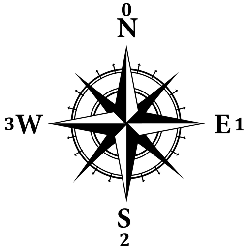

# Milestone 3

## Objective
Our objective for Milestone 3 was to implement a search algorithm in simulation as well as in real life. In both, the robot must display a "done" signal at the end of the search (i.e. once all explorable squares have been visited).

## Procedure

### Simulation
We chose to write our simulation in Python, due to the simplicity of interfacing with graphics. We used the [Pygame library](https://www.pygame.org/) for the display, which is often used for simple game development. To create the virtual environment that would simulate the real-life maze, we wrote two classes. The class Square would create each "square" (i.e. intersection in the maze) with attributes describing its (x,y) coordinate, index (from 0-19), and if any walls surround the square.

```
class Square():
	""" 
	Instance is each grid square.
	"""

	def __init__(self, x, y, index, right, down, left, up):
		self.x = x
		self.y = y
		self.index = index
		self.right = right
		self.down = down
		self.left = left
		self.up = up
```

The Maze class initializes the maze itself, which is a 2D array of Square objects. There are functions within this class that assist with its usability. makeSquares() creates the 2D array, assigning the coordinates and indicies; and setupWalls() uses two presumably assigned "horizontal wall" and "vertical wall" 2D arrays to assign each Square's directional wall attributes.

```
	def makeSquares(self):
		x = 0
		y = 0
		index = 0
		right = 0
		down = 0
		left = 0
		up = 0
		for row in range(ROWS):
			for col in range(COLS):
				self.squares[row][col] = (Square(row, col, index, right, down, left, up))
				index = index + 1

	def setupWalls(self, hwall, vwall):
		for row in range(ROWS):
			for col in range(COLS):
				if hwall[row][col] == 1:
					self.squares[row][col].up = 1

				if hwall[row + 1][col] == 1:
					self.squares[row][col].down = 1

				if vwall[row][col] == 1:
					self.squares[row][col].left = 1

				if vwall[row][col + 1] == 1:
					self.squares[row][col].right = 1
```

After initializing the squares, Maze, walls, and the Pygame library, we define two more functions--depth first search, and drawing the maze. The drawing function simply interfaces with the Pygame library, setting the color of the squares, and drawing in walls if applicable.

Depth first search seemed like the natural go-to search algorithm, as a robot can efficiently continue down a path, but it cannot teleport to diagonal squares like breadth-first would require. Since Python allows modification of the size of lists, we initialize three lists to use as stacks--visited (i.e. which squares the robot has gone to), a frontier (in order, the next squares to visit), and a path (in order, the squares visited) to facilitate backtracking when it is needed. First, we implemented the search itself with no real-life analog, as "paths" were not taken into account, only visited versus unvisited squares (additionally, at this point, we were not sure how to display the walls).

[](https://www.youtube.com/watch?v=R9SG0TY4oV8)

To more realistically simulate the robot, we needed to not have the "current" location teleport to nonadjacent squares. To do this, we used a variable "goback" to determine if a dead-end is hit, whether with walls or due to all adjacent squares being visited. Our next attempt at this was to pop things back off of the visited stack until unvisited squares were visited, but this posed this issue where, due to the adjacency of squares, added squares to the frontier multiple times. The robot would then go back to squares unnecessarily. Here is an example:

[](https://www.youtube.com/watch?v=sWuasLnlQh4)

Starting by adding the first, _start_ square to the frontier, if going back is not necessary, we set a _current_ variable to be what is popped off the frontier. We set this to be blue (against the green of visited squares) to signify it is the current square. Putting it in the path, additionally, if this square is not already visited, we put it in visited. 

To determine how to add squares to the frontier, we set a definitive priority--most prioritized was east, then south, west, and north (as we set our grid to be landscape mode, with our start square in the top left). The simulation checks if there is a wall in a direction, and if not, set _next_ to that square. This more realistically simulates the robot, as it will not know whether it is surrounded by walls or not until it physically gets to the square--so our simulation "uncovers" walls as it goes. If the square should be visited, it is added to the frontier. 

```
    if current.up == 0: #if no wall to top
	next =  squares[current.x - 1][current.y] #up one
	hwall[current.x][current.y] = 0
	if next not in visited:
	    frontier.append(next)
```

This is repeated for each direction. If nothing was appended to the frontier, backtracking is required. In this situation, for each node in the frontier, if it's been visited, it can be removed from the frontier. If there is anything left in the frontier, the top of the path (i.e. the most recently visited square) is appended, such that popping off the modified frontier will effectively backtrack on the previously taken path. This continues until the robot reaches its goal, or the next unexplored square. Once at this goal, _goback_ returns to 0.

```
for node in frontier:
	if (node in visited):
		frontier.remove(node)
	tmp2 = path.pop()
	if (len(frontier) != 0):
		frontier.append(tmp2)
	goback = 0
```	    
At the end, the screen is cleared and "DONE" in text is displayed. Here are a few videos of the simulation:

[](https://www.youtube.com/watch?v=RPFqAKOzDf8)

[](https://www.youtube.com/watch?v=JWV8G73PGTc)

In the future, we would like to implement Dijkstra's algorithm, particularly in relation to finding a path across the maze to an unvisited square when backtracking is required.

### Robot

The concept for real-life implementation was to implement the bulk of it based on the Python simulation. We started from our robot base code that could sense walls and follow lines. In emulating our Square class, we created a Square struct with x and y coordinates.

```
typedef struct{
  int x; int y;
} Square;
```

We utilized the [StackArray](https://playground.arduino.cc/Code/StackArray) library to implement a dynamic stack for our frontier and path. To keep track of the visited squares, we created an array of size 20 (the maximum amount of vistable squares in our 4x5 grid). We initialize our _start_ square to (0,0), and push it to the frontier. 

The main change between our simulation and real-life implementation is keeping track of the robot's orientation, to properly turn to the next square. To do this, we kept track of the direction the robot with a variable, then used it in conjunction with the coordinates the robot was at and the coordinates the robot was to go next. From the coordinates, we determined if the robot was going north, south, east or west in reference to our maze map. This would give us both the cardinal direction and new orientation of the robot. 0 corresponded to north, 1 to east, 2 to south, and 3 to west. 



```
char reorient(char current[], char next[], char curr_o) {
  char next_o = 0;
  char diff[] = {0, 0};
  diff[0] = next[0]-current[0];
  diff[1] = next[1]-current[1];
  
  if (diff[0] == -1){ //north
    next_o = 0;
  }
  else if (diff[0] == 1){ // south
    next_o = 2; 
  }
  else if (diff[1] == -1){ // west
    next_o = 3; 
  }
  else if (diff[1] == 1){ // east
    next_o = 1;
  }
```

The next part of the code calculated how the robot should turn based on how its orientation should change. With the cardinal number system described above, we can determine whether the robot should go straight, turn left or right, or turn around by subracting the new orientation from the current orientation. A table below with the corresponding values calculated describes how the robot acts, and the next part of the code below shows this in action.

| Calculated Value | Action |
| ---------------- |:------:|
| 0 | Straight |
| -1, 3 | Left |
| 1, -3 | Right |
| -2, 2 | Turn Around (Flip) |

```
  if (next_o - curr_o == 0){
    //straight
    forward();
    delay(200);
  }
  else if (next_o - curr_o == 1 || next_o - curr_o == -3){
    //turn right
    right();
    delay(800);
  }
  else if (abs(next_o - curr_o) == 2){
    //flip
    flip();
    delay(1250);
  }
  else if (next_o - curr_o == -1 || next_o - curr_o == 3){
    //turn left
    left();
    delay(800);
  }
  
  curr_o = next_o;
  Serial.println(curr_o);
  
  stp();
  return curr_o;
}
```

Finally, the robot updates its new orientation and returns to line following code. To test this, we manually wrote what each _next_ square should be. A video of the code being tested can be found below.

[](https://www.youtube.com/watch?v=crRketHEy54)

Our reorientation code requires inputs of a _current_ square, the _next_ square, and the current _orientation_. These are given from our depth first search implementation. The DFS function follows the logic of our simulation, referring to each square by its (x,y) coordinates. While the frontier is not empty, if backtracking is not required, we find the _current_ node, check if it is visited, and visit it if it hasn't been. Again, it is also added to the path stack.

To determine the coordinates of the next square, the wall sensors are checked. If there is no wall, the corresponding direction determines the next square to visit. If it has not yet been visited, it is added to the frontier. This happens in reverse order of our priority, and is repeated for each direction. 

```
if(wallL == 1){ //no wall on left
        if(orient == 3){
          next.x = current.x + 1;
          next.y = current.y;
        }
        else if(orient == 2){
          next.x = current.x;
          next.y = current.y + 1;
        }
        else if(orient == 1){
          next.x = current.x - 1;
          next.y = current.y;
        }
        else if(orient == 0){
          next.x = current.x;
          next.y = current.y - 1;
        }
        if(!isMember(next, visited, visitedSize)){
          frontier.push(next);
        }
      }
...
```

isMember() is a function to simply check if a square has been visited. The definition of this function uses squareCompare(), which checks if the (x,y) coordinates of the two squares are equivalent. At this point, we wanted to check our basic DFS without walls was working. Here is the test:

[](https://www.youtube.com/watch?v=Xgz4F1bXa_Q)

After determining this was successful, we returned to the code. At the end of checking the wall sensors (of which we have three--two on the sides and one in front), if nothing was added to the frontier, the robot needs to backtrack. 

[Return to home](https://sofyacalvin.github.io/ece3400-group3/)
