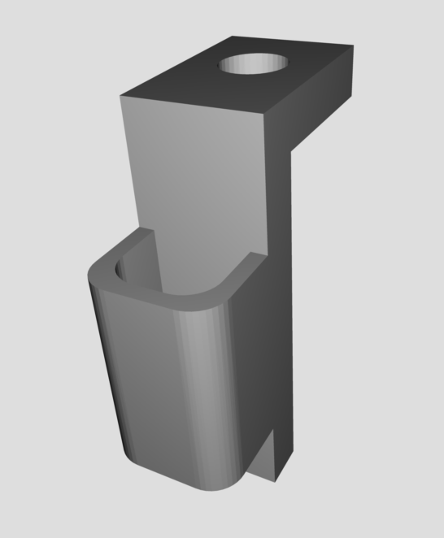
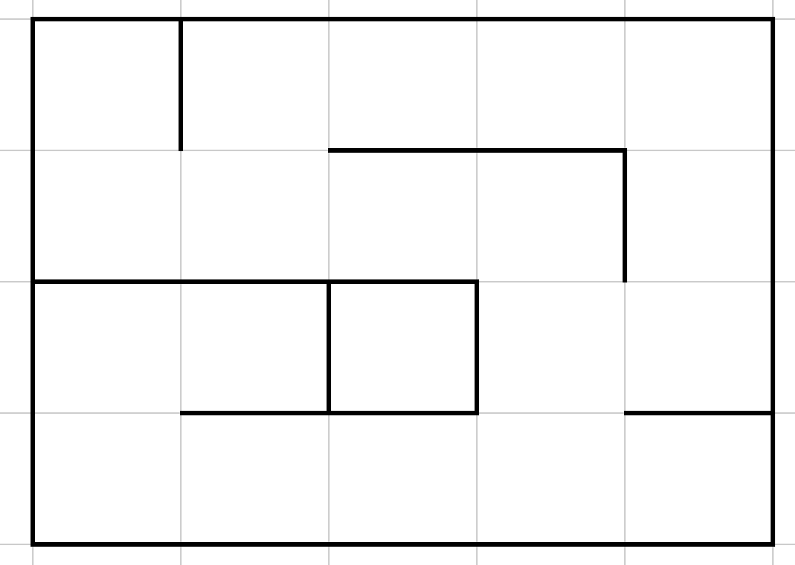

# Milestone 4

## Objective
The objective of Milestone 4 is to prepare Brooklynn for the final competition: displaying walls and treasures as the robot explores, and displaying a *done* signal as well as playing a *done* tone when the maze has been fully mapped. Additionally, we spent a significant portion of time completing unfinished tasks and improving previous work.

## Procedure

### Backtracking algorithm

add text about backtracking, integrating treasure and radio code, etc! i just added the videos, put them wherever you want! also please delete this line when you're done. also i added a little bit about about the treasure code 

---

Instead of shorting the treasure sensors together, we decided to toggle quickly between analog pins 3 and 4 on each iteration of the FFT.

```
if (ADMUX == 0x43){
      ADMUX = 0x44;			//a4
      DIDR0 = 0x05;
    }
else if (ADMUX == 0x44){
  ADMUX = 0x43;       		//a3
  DIDR0 = 0x04;
    }
```

This data is collected on the robot and sent via radio to the base station.

Once the robot has reached an intersection, it checks for treasures. Within DFS, it checks for walls in order to add squares to the frontier--this is when we also update the _walls_ variable. Its update to the walls depends on its orientation, as in Milestone 3. Shifting the data as usual, the packet is sent through radio. The receiving Arduino receives the data and sends it to the FPGA through SPI.




### Implementing SPI
We have reformatted our packets to send the data we will actually need to display the correct data. We are using a 16-bit packet, like so:

```
valid | done | 17kHz | 12kHz | 7kHz | north | east | south | west | orientation | orientation | x | x | x | y | y
```

We use a valid bit in order to determine which data to "throw away," such as any startup inconsistencies or the 16b'0 signal that may send at the beginning. The done bit is self-explanatory--this will be 1 when the robot has finished exploration and 0 otherwise. The following three bits describe if the robot has detected a treasure, and the respective bits describe the frequency. The next four bits describe if the robot has detected walls, and what direction the wall is in. Orientation follows the same guidelines as we used in [Milestone 3](../milestones/Milestone3.md), as do the x and y coordinates. 

SPI has been a source of some pain on this team. In [Lab 4](../labs/lab4.md), we utilized parallel communication, under the assumption it would be a simpler implementation. We recognized that we would not have enough digital pins to do so, and made the switch to SPI (which uses less pins on the Arduino) for this milestone. 

Our SPI uses three main lines--Master Out Slave In (MOSI), Clock (SCK), and Slave Select (SS). We connected the receiving Arduino to the FPGA. When the SS pin is low, it communicates with the master (i.e. the Arduino). A new driver was written to read in the data from the radio module, check which slave to send to, send the data, and check for a successful transfer.

Debugging:

Oddly, we were having an issue with using the MISO pin, despite there only being one master and one slave. When the line was connected to the Arduino, data transmission would stop. Unplugging the MISO pin allowed the transmission to continue as usual. Considering that we don't need to send data from the slave to the master, we have just left it unplugged.

### Finish tune

We wanted to create a tune instead of having a plain finish tone. We transcribed "Take Me Out to the Ball Game" and defined the C5-C6 major scale's frequencies for convenient use. From there, since we are only using 24 beats of the song, we modified our sound generation code from Lab 3 to check which _note_ values (i.e. "indexed" beat of the song) corresponded to which notes in the scale. Here is a snippet of our song definition code:

```
if (note == 0 || note == 1 || note == 12 || note == 13) begin	//C5
	count <= CLKDIVIDER_C5 - 16'b1;
	note <= note + 5'b1;
end
else if (note == 9 || note == 10 || note == 11 ) begin			//D5
	count <= CLKDIVIDER_D5 - 16'b1;
	note <= note + 5'b1;
end

...
```

And so on. The actual tune can be heard in this video (the first C5 is hard to hear):

[](https://www.youtube.com/watch?v=YnziLtI_s6o)


### Displaying data

Once the FPGA receives this packet of data, it parses the data back into the respective sections, e.g. valid bit, done, treasures, etc. A new driver was written to update the maze graphic. After initializing our maze with walls to zeros, we iteratively check if each square needs to be updated, and if not, to keep it the same. This is where we update the color of the square if a treasure is present:

```
if ( treasures == 3'd0 ) begin //no treasures
		if ( maze_state[maze_x][maze_y] == 3'd0 ) maze_state[maze_x][maze_y] <= 3'd1;
		else maze_state[maze_x][maze_y] <= maze_state[maze_x][maze_y];
	end
	else begin
		case(treasures)
			3'b001: maze_state[maze_x][maze_y] <= 3'd4; //7kHz
			3'b010: maze_state[maze_x][maze_y] <= 3'd5; //12kHz
			3'b100: maze_state[maze_x][maze_y] <= 3'd6; //17kHz
			default: maze_state[maze_x][maze_y] <= 3'd7;
		endcase
	end
```

Without this iteration, an inferred latch occurs. The walls are assigned based on the location of the square, the orientation of the robot, and the wall data received through SPI. Once everything is assigned, the colors are updated to reflect the respective state of the square or wall. These colors are predefined and/or are 

To test if the graphics were updating correctly based on the data, we created a MATLAB script to create packets that would simulate our manually assigned mazes. Below is a partial maze test.

[](https://www.youtube.com/watch?v=0-J19PKXrj4)

After working out the bugs, we added an arrow to show the current orientation. The following map corresponds to the successful run below it:



[](https://www.youtube.com/watch?v=401oCFdBCfc)

We currently have an issue with the top row not displaying walls correctly. However, the maze display otherwise responds correctly to the inputs. We plan to fix this error before the final competition.

After completing both the display and finish tune, we integrated both together with much success. The display shows the robot complete the maze, then turns green and plays "Take Me Out to The Ball Game." The video can be seen below.
Debugging:

We had a lot of issues with displaying the data. Our primary issue was seemingly arbitrary walls and squares showing up when they had been neither explored nor called at all. The root of this issue had been the clock speeds, in which we were running our grid driver slower than SPI and VGA output. The changing signals became stable once we set the clock speeds to be the same.

[](https://www.youtube.com/watch?v=6-xsw_91FSI)


### Future work
While we didn't quite have time to combine all of the components of this milestone, we have done enough unit testing to be confident that we will be able to integrate the radio sending code for the final competition. 

Additionally, we have been working on implementing Dijkstra's algorithm to backtrack more efficiently. This is mostly functional, as can be seen in the videos below:

[](https://www.youtube.com/watch?v=zIg74VQQIzY)

[](https://www.youtube.com/watch?v=j25lZeRPJQ8)

However, they do not fully finish, and would then fail to send a _done_ signal. This is why we chose to revert to our functional DFS code with backtracking for this lab, but we will finish up Dijkstra's later.

Although the display is (mostly) functional, the solid colors used are generally unappealing. We plan to change the graphics to use images for the ground, background, and walls. We also want to display our robot with a more appealing icon, instead of just an arrow. In addition, the small squares between walls will be addressed to blend in with walls and/or the ground to make the grid appear more seamless.

Finally, we plan to clean up the wiring on Brooklynn to avoid catching on things as well as simple aesthetics, and are ordering faster servo motors to replace the slower ones we are currently using. We are also getting voltage regulators to use in conjunction with the new servos.

[Return to home](https://sofyacalvin.github.io/ece3400-group3/)
